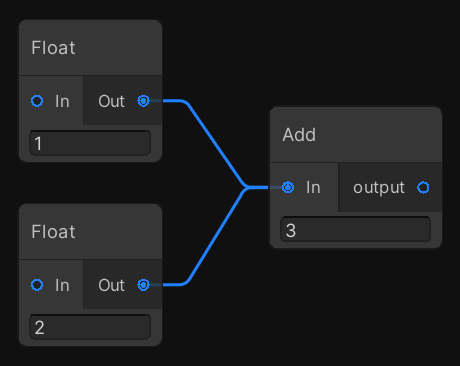
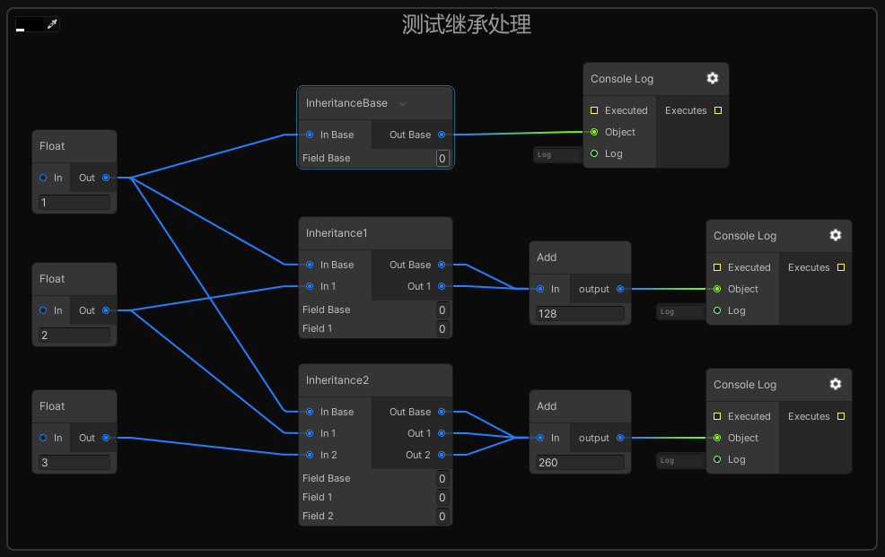

# NodeGraphProcessor + Odin

Node graph editor framework focused on data processing using Unity UIElements, GraphView and C# 4.7

这个项目是本人NodeGraphProcessor接入Odin序列化的示例。**本仓库将持续跟进更新。 目前已同步更新至 https://github.com/alelievr/NodeGraphProcessor/commit/efd190c1d24ff785ba75183fd88a501a3e941c7e**

NodeGraphProcessor版本：https://github.com/alelievr/NodeGraphProcessor/

Odin插件官网地址：https://odininspector.com/ （使用本仓库需要自行购买Odin然后导入至Plugins文件夹下）

相关博客：https://www.lfzxb.top/nodegraphprocesssor-and-odin/

## 功能

 - 接入Odin序列化
 - 支持List，Dictionary，HashSet，Stack等泛型集合序列化与可视化
 - 重写GraphView生命周期，优化初始化流程和加载时间
 - 节点之间值传递通过泛型优化为0GC
 - 支持Node端口图标自定义
 - 支持ExposedParameter模块的Icon以及Value的渲染
 - 支持快速自定义Graph，GraphView，GraphWindow，GraphToolbar
 - 支持GraphEditorWindow中新建GraphAssets
 - 支持预览节点间数据流向
 - 支持GraphView的分帧加载

## 基于此项目的拓展内容

### 技能编辑器
[基于行为树的MOBA技能系统（国内码云）](https://gitee.com/NKG_admin/NKGMobaBasedOnET)
[基于行为树的MOBA技能系统（国外GitHub，暂未同步更新）](https://github.com/wqaetly/NKGMobaBasedOnET)


## 截图

### 在GraphView选中节点后，由Odin在Inspector面板显示节点信息


### 端口自定义图标演示


### 选中Graph Asset文件后，由Odin在Inspector面板显示整个Graph信息


### SkillGraph提供了预览节点数据流向示例


## 使用

### 节点端口值的获取与操作

由于我们重写了这部分的代码来达到值传递0GC的目的，**所以那些原本由框架通过反射提供的节点之间值传递需要我们自己手动来做**，这部分工作主要为

- （必须）显式调用TryGetInputValue进行入端口值的获取操作
- （必须）显式重写TryGetOutputValue来获取此节点的输出值
- （可选）显式调用TryGetAllInputValues来进行单个入端口的自定义操作，这个API可以获取单个入端口所连接的所有出端口的值

#### 正常的出端口和入端口值获取


```csharp
[System.Serializable, NodeMenuItem("Conditional/Switch")]
public class SwitchNode : BaseNode
{
	[Input(name = "In")]
    	public float                input;

	[Output(name = "Out")]
	public float				output;

	public override string		name => "Switch";
	
	protected override void Process()
	{
        	//获取入端口的值，第一个参数为要获取值的字段名称，推荐使用nameof
        	//第二个参数是要获取值的字段，使用ref传递方便进行修改
		TryGetInputValue(nameof(input), ref input);
		output = output = input * 42;
	}
	
    	/// <summary>
	/// 获取出端口的值
	/// </summary>
	/// <param name="outputPort">output端口</param>
	/// <param name="inputPort">与上面的output端口相连的input端口</param>
	/// <param name="value">要返回的值</param>
	/// <typeparam name="T"></typeparam>
	public override void TryGetOutputValue<T>(NodePort outputPort, NodePort inputPort, ref T value)
	{
		if (output is T finalValue)
		{
			value = finalValue;
		}
	}
}
```

#### 单个入端口连接了多个出端口



```csharp
[System.Serializable, NodeMenuItem("Custom/MultiAdd")]
public class MultiAddNode : BaseNode
{
	[Input]
	public IEnumerable< float >	inputs = null;

	[Output]
	public float				output;

	public override string		name => "Add";

	protected override void Process()
	{
		output = 0;
		inputs = TryGetAllInputValues<float>(nameof(inputs));
		if (inputs == null)
			return ;

		foreach (float input in inputs)
			output += input;
	}

	public override void TryGetOutputValue<T>(NodePort outputPort, NodePort inputPort, ref T value)
	{
		if (output is T finalValue)
		{
			value = finalValue;
		}
	}

	[CustomPortBehavior(nameof(inputs))]
	IEnumerable< PortData > GetPortsForInputs(List< SerializableEdge > edges)
	{
		yield return new PortData{ displayName = "In ", displayType = typeof(float), acceptMultipleEdges = true};
	}
}

```

#### 出端口的自定义处理


```csharp
[System.Serializable, NodeMenuItem("Custom/CircleRadians")]
public class CircleRadians : BaseNode
{
	[Output(name = "In")]
	public List< float >		outputRadians;

	public override string		name => "CircleRadians";

	public override void TryGetOutputValue<T>(NodePort outputPort, NodePort inputPort, ref T value)
	{
        	//因为此节点会根据出端口所连接的多个入端口顺序为入端口分配值，所以需要判断传进来的inputPort的Index
		int inputPortIndexInOutputPortEdge = outputPort.GetEdges().FindIndex(edge => edge.inputPort == inputPort);
		if (outputRadians[inputPortIndexInOutputPortEdge] is T finalValue)
		{
			value = finalValue;
		}
	}
}
```



```csharp
using System.Collections;
using System.Collections.Generic;
using UnityEngine;
using GraphProcessor;
using System.Linq;

[System.Serializable, NodeMenuItem("Custom/Inheritance2")]
public class Inheritance2 : Inheritance1
{
    [Input(name = "In 2")] public float input2;

    [Output(name = "Out 2")] public float output2;

    public float field2;

    public override string name => "Inheritance2";

    protected override void Process()
    {
        base.Process();
        TryGetInputValue(nameof(input2), ref input2);
        output2 = input2 * 44;
    }
	
    public override void TryGetOutputValue<T>(NodePort outputPort, NodePort inputPort, ref T value)
    {
        //因为此节点有多个输出端口，所以需要判断所需要的数据是哪个端口
        switch (outputPort.fieldName)
        {
            case nameof(output1):
                if (output1 is T finalValue1)
                {
                    value = finalValue1;
                }
                break;
            case nameof(output2):
                if (output2 is T finalValue2)
                {
                    value = finalValue2;
                }
                break;
        }
    }
}
```

更多示例可见仓库中的 https://github.com/wqaetly/NodeGraphProcessor/tree/master/Assets/Plugins/Examples/DefaultNodes/Nodes 

## TODO

 - [x] 在Inseoctor面板修改的Node数据需要即时渲染在Graph上。原因是仓库原生版本是用了BaseNodeView + NodeCustomEditor做协调同步，而我们使用Odin序列化后就丢失了特定NodeView的相关信息，已修复，使用`[OnValueChanged(nameof(UpdateFieldValues), true)]`即可自动监控Node的数据变化然后进行绘制更新
 - [x] ~~不同的Graph需要有不同的节点搜索范围。例如行为树Graph在创建节点时只会搜索行为树相关节点内容而不会搜索到碰撞关系编辑器相关节点内容~~ （这是原生库自带的功能，填充NodeMenuItem的onlyCompatibleWithGraph即可，手动流汗黄豆）
 - [x] 优化节点之间值传递消耗为0GC (由于支持自定义每个端口的处理，而框架不可能知道我们自定义节点端口的逻辑是什么样的，所以自定义节点值传递已无优化空间，只能通过反射进行，但这种反射传递值只发生在进行自定义端口处理的时候，默认情况下是直接通过表达式树赋值的，效率尚可），但如果想要进一步优化拆装箱和反射消耗，我们可以自己手写那些原本被框架所托管的代码来达到优化的目的。
 - [x] 优化一些反射操作的扫描程序集范围，现在耗时非常严重，甚至还扫描了mscorlib程序集中的类型
